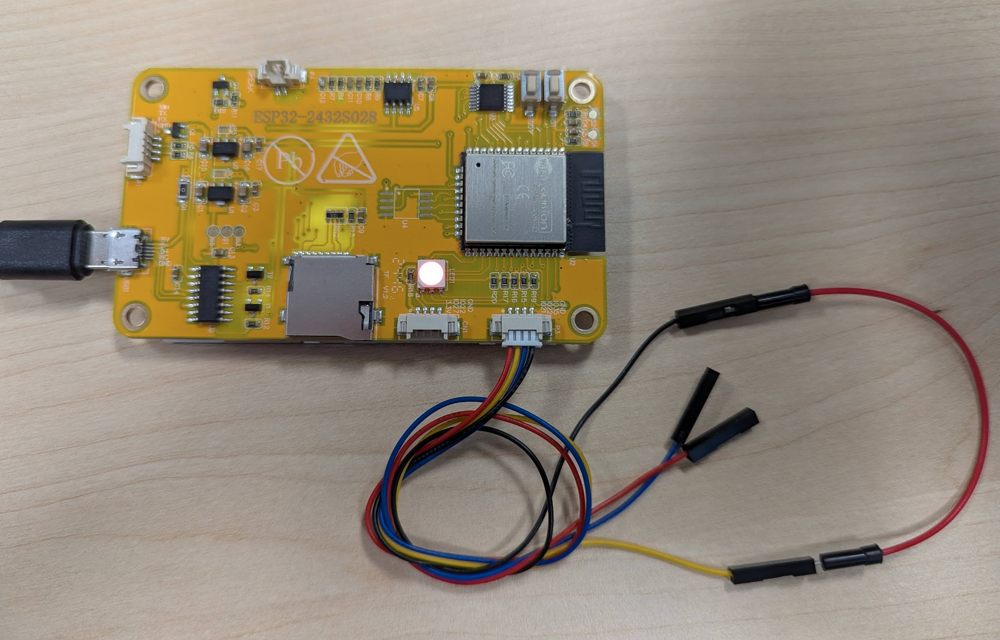

# MorphocamCYD
Morphocam CYD ESP32 terminal

This uses a cheap yellow display (CYD) ESP32-2432S028R which has a 2.8 inch TFT screen as a serial display for single board computers to show status messages. Code/instructions here are heavily drawn from:

https://randomnerdtutorials.com/esp32-cheap-yellow-display-cyd-pinout-esp32-2432s028r/

https://randomnerdtutorials.com/micropython-cheap-yellow-display-board-cyd-esp32-2432s028r/

https://github.com/rdagger/micropython-ili9341

# Step 1: Install micropython onto the ESP32 board. 

The easiest thing to do is to download Thonny IDE:
https://thonny.org

We now need to flash the micropython runtime onto the board. It can be done by downloading the generic ESP32-WROOM firmware https://micropython.org/download/ESP32_GENERIC/ (it is here as well: [esp32micropython\ESP32_GENERIC-20250415-v1.25.0.bin](esp32micropython\ESP32_GENERIC-20250415-v1.25.0.bin)), but the easiest is to just use Thonny itself.

Flash the firmware onto the board using thonny.

Go to Tools > Options > Interpreters


Tell it to fetch the latest ESP32-WROOM firmware:


Click "install" and it should take a minute or so to download:


And then successfully finished:


There should now be a REPL terminal where we can type Python directly:


Type "help()" to just check it is happy


Finally, copy-paste this into the Shell to check all is working:

```python
from machine import Pin
from time import sleep
led = Pin(4, Pin.OUT)
while True:
  led.value(not led.value())
  sleep(0.5)
```

The red led on the back of the board should start flashing.

# Step 2: Download libraries

In the [simpleterminal](simpleterminal/) folder on the repo there are three library files that need to be saved onto the esp32. Download these and then we will copy them onto the esp32.

Click view-files to see the file window of the esp32:


Currently, there will only be the `boot.py` file.

Make a new file, and copy the contents of `ili9341.py` to this window. Click File-Save As and then save to the micropython, using the exact same file name.


Repeat for `xglcd_font.py` and `xpt2046.py` (although we don't actually even use these features in this basic version).

It should now look like this:


# Step 3: 

Copy in the `main.py` file from the [simpleterminal](simpleterminal/) folder on the repo. Now push the "run" green button and it should now load up as a serial port terminal e.g. ttyACM0 with settings of 115200,8,N,1. In windows, it should appear as some sort of virtual com/serial port. On windows, we can just use something like RealTerm to interface to it. Linux/Mac is much easier as it is just a stdout on ttyACMx.

Each time a line is sent over the terminal, it will add to the scroll display. The current system time should be displayed in the lower right corner.


# Step 4:

The terminal will not allow thonny to talk to the board anymore (REPL is disabled). To get back to REPL and the ability to change/update the code, it is necessary to use the safe-pin (currently GPIO21) and ground it. This can easily be done using the cable that comes with the set, and connecting the yellow (GPIO21) to black (ground) connection:



Connect this cable, press RESET button on the board, and it should now reappear in Thonny. 
To go back to running terminal mode, simply remove the cable and RESET again.


